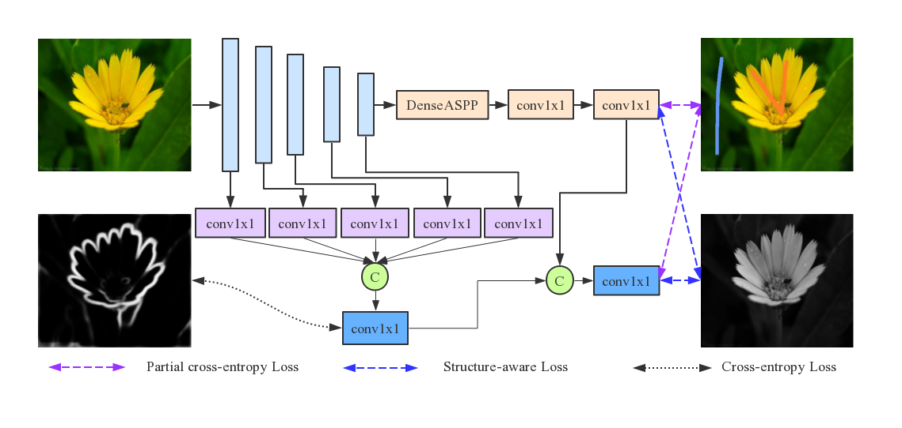

# Scribble_Saliency (CVPR2020)
Weakly-Supervised Salient Object Detection via Scribble Annotations

# Scribble Dataset
We manually labeled the benchmark saliency dataset DUTS with scribble, and provided three versions of scribble annotations with thin scribbles and wider scribbles (salient foreground region: 1, background region: 2, unknown pixels: 0):

1) thin scribbles:

https://drive.google.com/open?id=10fGhQBN5VQqeSyQDKAO5_P2_w9Nn5_w_

2) wider scribbles:

https://drive.google.com/open?id=1umNUJaU8pNlA4pIbV5MSDKHcKEYXPlRU

We also labeled the fixation prediction dataset Salicon (the 10K training training dataset) with scribble for further research on weakly supervised salient object detection and fully supervised fixation prediction.

3) scribble labeling of Salicon training dataset:

https://drive.google.com/open?id=1NhEdBl7pas0us_BvWsQVll_QtJJVh_JR

# Our Results:

We provide saliency maps of our model on seven benchmark saliency dataset (DUT, DUTS, ECSSD, HKU-IS, PASCAL-S, SOD, THUR) as below:

https://drive.google.com/open?id=1Y1R-LgxszoqWmo56SWVozW7S03z69W1a

# Benchmark Testing Dataset (DUT, DUTS, ECSSD, HKU-IS, PASCAL-S, SOD, THUR):

https://drive.google.com/open?id=11rPRBzqxdRz0zHYax995uvzQsZmTR4A7

# Our Bib:

Please cite our paper if you like our work:

@InProceedings{Scribble_Sal_2020_CVPR, 

  author = {Jing Zhang, Xin Yu, Aixuan Li, Peipei Song, Bowen Liu, Yuchao Dai},
  title = {Weakly-Supervised Salient Object Detection via Scribble Annotations},
  booktitle = {The IEEE Conference on Computer Vision and Pattern Recognition (CVPR)},
  year = {2020} 
  
}

# Contact

Please drop me an email for further problems or discussion: zjnwpu@gmail.com

